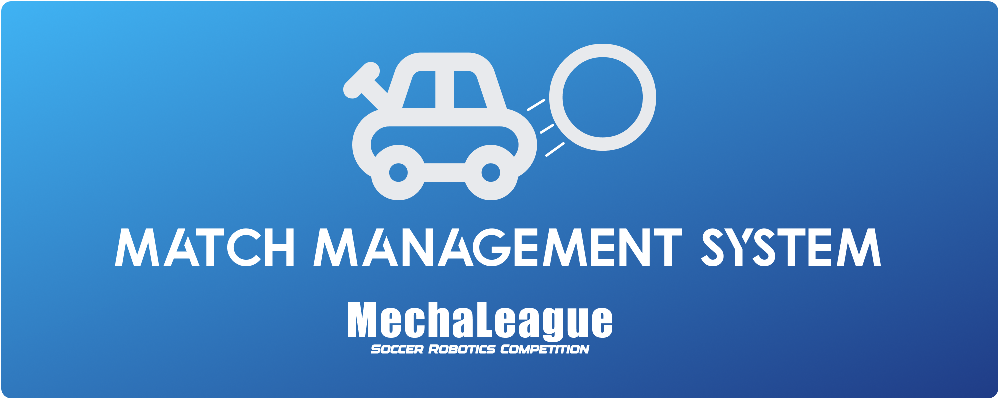
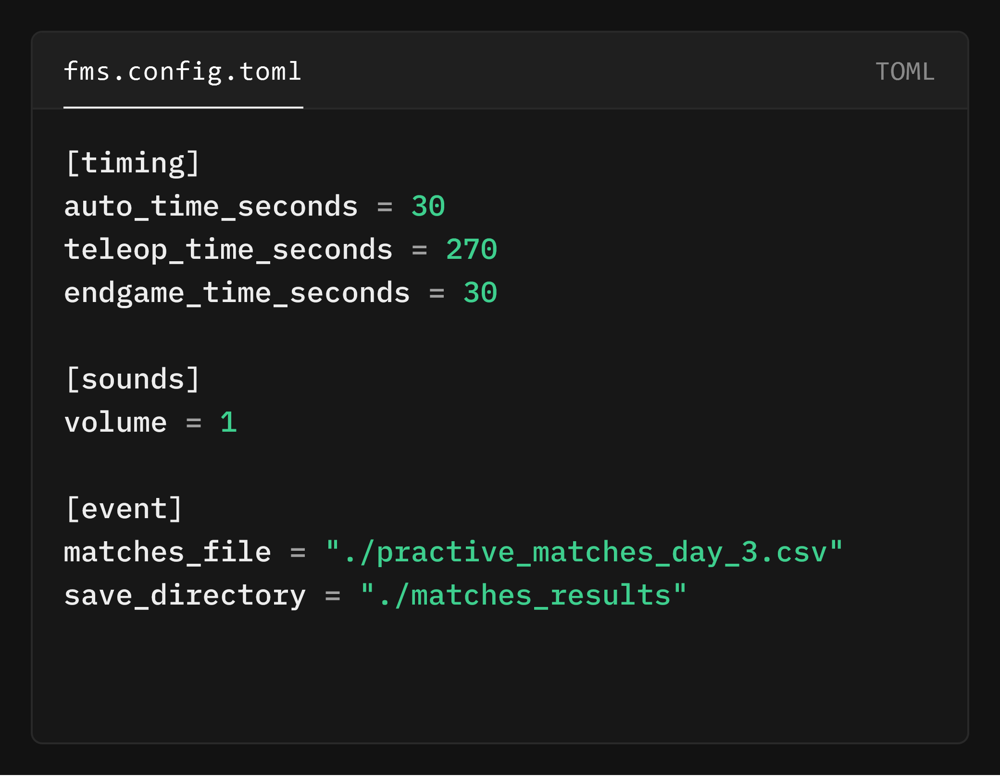
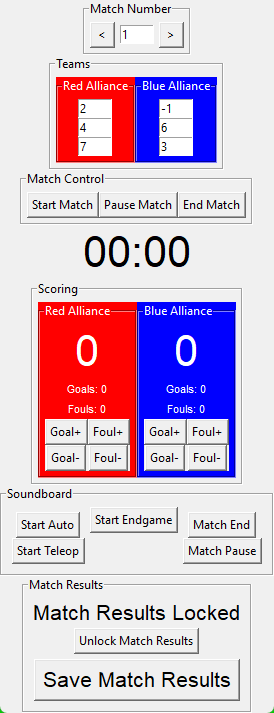
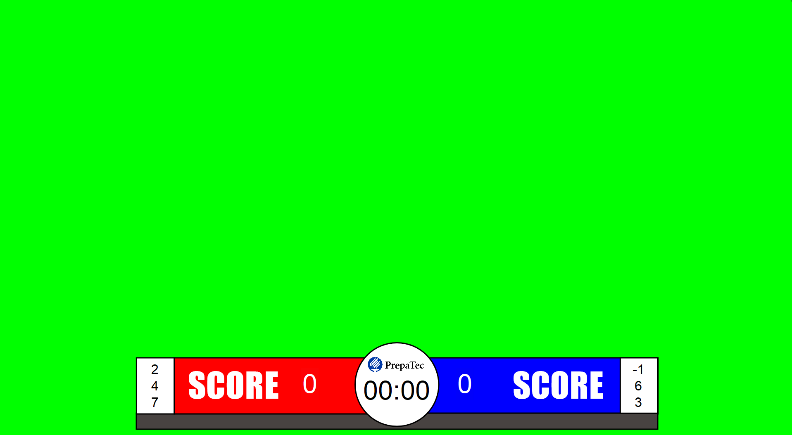

# MechaLeague Match Manager
Open source Match Management program with overlays and screens for streaming 

## Modular configuration
Fully configurable MMS, configured within fms.config.toml file, timing configured within the FMS and teams for matches are stored in a CSV file

## Easy to use UI
Built around the Tkinter framework, all components are native, offering great performance while being lightweight

## Highly interactive
The MMS automatically plays sounds at the start of a match, at the start of teleop, at the start of endgame and at the end of the match. Everything can be controlled within the UI, using hotkeys or (WIP) with a Novation Launchpad MK2

## Easy to use overlays
Simply add the overlay as a window capture in OBS, add a croma key effect and enjoy your competition!

